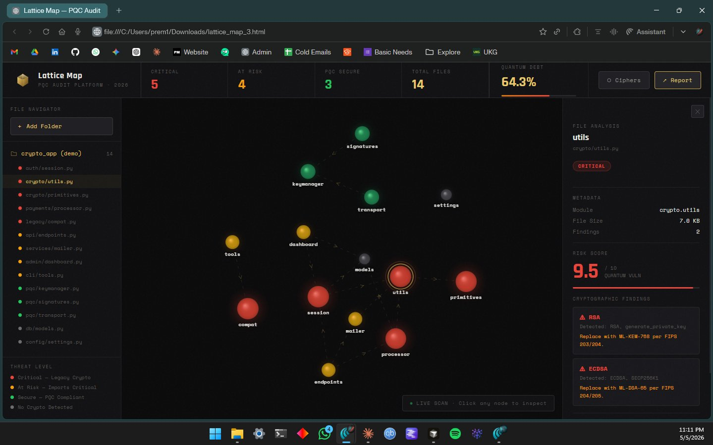
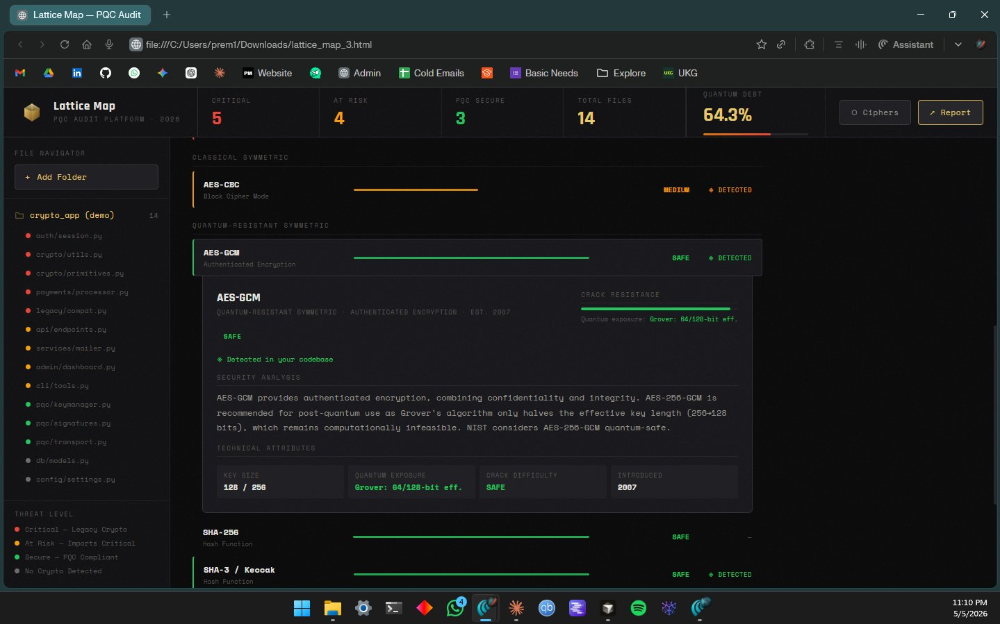
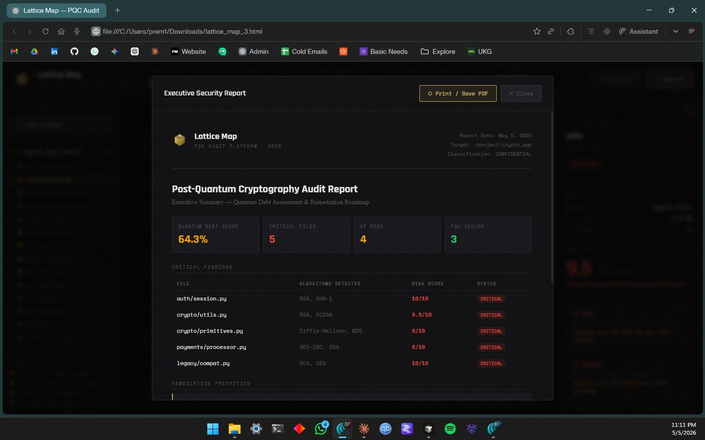

<div align="center">


<br/><br/>


<h1 align="center" style="font-size:3em; font-weight:900; letter-spacing:4px;">LATTICE MAP</h1>


### Post-Quantum Cryptography Audit Platform · 2026 Standard

*Map your codebase. Quantify your Quantum Debt. Migrate before the threat arrives.*

</div>

---

## The Problem

A sufficiently powerful quantum computer running **Shor's algorithm** will break RSA, ECDSA, DSA, and Diffie-Hellman in polynomial time. These are the asymmetric primitives securing virtually every production system running today. Nation-state adversaries are already running **"Harvest Now, Decrypt Later"** operations, recording encrypted traffic now so they can decrypt it once their quantum capability matures.

You likely have quantum-vulnerable cryptography in your codebase right now. You probably don't know exactly where.

Lattice Map is the tool that shows you.

---

## What It Does

```
Your Codebase
     |
     v
+-----------------+     +------------------------------------------+
|  Scanner        |---->|  Force-Directed Dependency Graph          |
|  lattice_map_   |     |  +------------+                           |
|  scanner.py     |     |  | RED        |  Contains legacy crypto   |
|                 |     |  | YELLOW     |  Imports a RED module     |
|  Scans:         |     |  | GREEN      |  PQC-compliant            |
|  · Python       |     |  | GREY       |  No crypto detected       |
|  · JavaScript   |     |  +------------+                           |
|  · TypeScript   |     |                                           |
|  · Java         |     |  Click any node -> Threat analysis panel  |
|  · Go           |     |  Click Ciphers -> Full cipher registry    |
|  · Rust         |     |  Click Report  -> Executive PDF report    |
|  · C / C++      |     +------------------------------------------+
|  · Ruby, PHP    |
|  · Swift, C#    |
|  + 10 more      |
+-----------------+
          |
          v
       data.json
```

---

## Screenshots

### Main Graph: Blast Radius Visualization



The force-directed graph shows your entire codebase as an interactive node network. Red nodes contain quantum-vulnerable algorithms. Yellow nodes have inherited risk through their import chain, which is the Blast Radius. Hover any node to see its connected dependencies light up in real time.

### Cipher Registry



Every cryptographic algorithm Lattice Map recognizes, from broken legacy ciphers to NIST 2024 PQC standards, in a single view. Algorithms detected in your codebase are highlighted. Click any row for an inline security analysis, quantum exposure rating, and technical attributes that expand right next to the row you clicked.

### Executive Report



One-click executive summary with your quantum debt score, critical findings table, and a prioritized remediation roadmap. Print directly to PDF for your CISO or compliance team.

---

## Quantum Debt: The Core Metric

```
Quantum Debt Score = (Critical + At-Risk Files) / Total Files x 100%

+-----------+------------------------------------------------------+
|  RED      |  File directly contains legacy crypto signatures     |
|           |  RSA, ECDSA, DSA, DH, SHA-1, MD5, AES-CBC, RC4, DES |
+-----------+------------------------------------------------------+
|  YELLOW   |  File imports a RED module (propagated blast radius) |
|           |  Risk score 5.0 / Inherits all upstream exposure     |
+-----------+------------------------------------------------------+
|  GREEN    |  Uses NIST PQC standards (FIPS 203 / 204 / 205)     |
|           |  ML-KEM, ML-DSA, SLH-DSA, AES-GCM, SHA-3            |
+-----------+------------------------------------------------------+
|  GREY     |  No cryptographic indicators detected                |
|           |  Can be manually audited and tagged                  |
+-----------+------------------------------------------------------+
```

---

## Risk Score Breakdown

| Algorithm | Risk Score | Quantum Attack | Status |
|-----------|-----------|----------------|--------|
| RC4 | **10 / 10** | Classically broken | Remove immediately |
| DES | **10 / 10** | Classically broken | Remove immediately |
| RSA-2048 | **10 / 10** | Shor's algorithm | Critical |
| DSA | **9 / 10** | Shor's algorithm | Critical |
| Diffie-Hellman | **9 / 10** | Shor's algorithm | Critical |
| ECDSA | **8 / 10** | Shor's algorithm | Critical |
| SHA-1 | **7 / 10** | Classically broken | Broken |
| MD5 | **7 / 10** | Classically broken | Broken |
| 3DES | **6 / 10** | SWEET32 + quantum | Deprecated |
| AES-CBC | **5 / 10** | No authentication | Upgrade the mode |
| **AES-256-GCM** | **0 / 10** | Grover: 128-bit eff. | Safe |
| **SHA-256** | **0 / 10** | Grover: 128-bit eff. | Safe |
| **ML-KEM-768** | **0 / 10** | M-LWE: hard | PQC Standard |
| **ML-DSA-65** | **0 / 10** | M-LWE: hard | PQC Standard |
| **SLH-DSA** | **0 / 10** | Hash-based: hard | PQC Standard |

---

## Quick Start

### Step 1: Scan your codebase

```bash
# Clone or download the repo
git clone https://github.com/premmadishetty/Lattice-Map.git
cd Lattice-Map

# No pip install needed, pure stdlib
python lattice_map_scanner.py /path/to/your/project --output data.json
```

**Example output:**
```
Scanning: /path/to/your/project

  src/auth/session.py          CRITICAL
  src/crypto/utils.py          CRITICAL
  src/api/endpoints.py         AT RISK
  src/pqc/keymanager.py        SECURE
  src/db/models.py             CLEAN

  Files scanned   : 47
  Critical        : 8
  At Risk         : 12
  Secure (PQC)    : 5
  No Crypto       : 22

  Quantum Debt Score : 42.6%
```

### Step 2: Open the frontend

```bash
# Just open the file directly
open lattice_map.html          # macOS
start lattice_map.html         # Windows
xdg-open lattice_map.html      # Linux

# Or serve it locally if your browser blocks local file reads
python -m http.server 8080
# then visit http://localhost:8080/lattice_map.html
```

### Step 3: Load your scan

1. Click **"+ Add Folder"** in the File Navigator on the left
2. Select your generated `data.json`
3. The graph loads instantly

You can also click **"Load Codebase Data"** on the welcome screen to explore the built-in demo project without running the scanner first.

---

## Supported Languages

| Language | Extensions |
|----------|-----------|
| Python | `.py` |
| JavaScript / TypeScript | `.js .mjs .cjs .ts .tsx .jsx` |
| Java | `.java` |
| Kotlin / Scala | `.kt .kts .scala` |
| Go | `.go` |
| Rust | `.rs` |
| C / C++ | `.c .cpp .cc .cxx .h .hpp` |
| Ruby | `.rb` |
| PHP | `.php` |
| Swift | `.swift` |
| C# | `.cs` |
| Elixir / Erlang | `.ex .exs .erl` |
| Shell Scripts | `.sh .bash` |
| Config / Secrets | `.yaml .yml .toml .env .json` |

The scanner automatically skips `.venv`, `node_modules`, `__pycache__`, `.git`, `target`, `vendor`, `Pods`, `.gradle`, `dist`, and `build` directories.

---

## Features

### Force-Directed Blast Radius Map
An interactive physics simulation you can pan, zoom, and drag around. Nodes self-organize based on their dependencies. Hover any node and watch the glow propagate through its dependency chain so you can see exactly how far the cryptographic risk reaches.

### File Navigator
Every scanned file listed on the left with color-coded threat indicators. Click any file name to jump straight to its node on the graph and open the analysis panel.

### Node Analysis Panel
Click any node to open the threat analysis drawer. It shows the file path, module name, file size, a risk score from 0 to 10, every detected algorithm with the exact code matches that triggered it, the specific NIST FIPS replacement recommendation, and a full picture of what imports this file and what it imports.

### Yellow Node Intelligence
At-risk yellow nodes show more than just "this is risky." They list all imported libraries by name, the count of critical dependencies pulling them in, and an explanation of how the risk propagated to reach them.

### Manual Audit and Override
For files where the scanner found no crypto signatures, a prompt appears asking whether the file might be handling sensitive data. You can manually tag any file as Verified Clean, Needs Review, or Manual Legacy Flag. The blast radius recalculates instantly and the risk propagates to any dependents.

### Cipher Registry
Eighteen algorithms fully documented in one place, covering everything from RC4 and DES to ML-KEM and SLH-DSA. Each one has a crack resistance bar, quantum exposure rating, a plain-English security writeup, and a note on whether it was found in your scan. Click any row and the detail card expands inline right next to the algorithm you clicked.

### Executive Report Generator
One click produces a PDF-ready report with your quantum debt score, the full critical findings table, a prioritized remediation roadmap, and any manual audit overrides you have applied. The dark theme carries through cleanly to print.

### Multi-Folder Support
Load multiple project scans and switch between them in the File Navigator. Each folder keeps its own data and any manual overrides you have applied.

---

## Architecture

```
Lattice-Map/
├── lattice_map_scanner.py   # backend scanner, pure Python stdlib, no dependencies
├── lattice_map.html         # entire frontend in a single self-contained HTML file
├── data.json                # scanner output, also used as the built-in demo
└── README.md
```

The frontend is vanilla JavaScript with the Canvas 2D API and CSS custom properties. The backend is Python 3.9+ using only `os`, `re`, `json`, and `pathlib` from the standard library. There is no npm install, no pip install, and no build step.

---

## NIST PQC Standards Reference

**FIPS 203: ML-KEM** (Module-Lattice Key Encapsulation Mechanism)
Replaces RSA encryption, Diffie-Hellman, and ECDH. Based on the hardness of Module Learning With Errors. Recommended parameter set: ML-KEM-768.

**FIPS 204: ML-DSA** (Module-Lattice Digital Signature Algorithm)
Replaces RSA-PSS, DSA, and ECDSA. Also based on Module Learning With Errors. Recommended parameter set: ML-DSA-65.

**FIPS 205: SLH-DSA** (Stateless Hash-Based Digital Signature)
Replaces RSA signing and ECDSA for use cases that need conservative security assumptions. Security depends only on the underlying hash function with no algebraic assumptions required. Available in several parameter sets including SLH-DSA-128s and SLH-DSA-256s.

---

## Roadmap

```
Phase 1: Foundation (Current)
------------------------------
[x]  Static analysis scanner across 14 language ecosystems
[x]  Force-directed graph with blast radius propagation
[x]  Node threat analysis panel
[x]  Cipher registry covering 18 algorithms
[x]  Executive report generator
[x]  Manual audit and override with live recalculation
[x]  Multi-folder support
[x]  Zero dependencies: one HTML file and one Python script

Phase 2: Intelligence (Q3 2026)
---------------------------------
[ ]  Deep AST parsing to eliminate regex false positives
[ ]  Line-number pinpointing so you see exactly where the issue is
[ ]  Semantic analysis to distinguish crypto usage from variable names
[ ]  Framework-specific signatures for Spring Security, Django, Rails
[ ]  Version-aware detection (e.g. openssl 1.x vs 3.x)
[ ]  SBOM (Software Bill of Materials) import support

Phase 3: Integration (Q4 2026)
--------------------------------
[ ]  GitHub Actions and GitLab CI integration
[ ]  Pre-commit hook to block new legacy crypto from being committed
[ ]  VS Code extension with inline editor warnings
[ ]  SARIF output for the native GitHub Security tab
[ ]  Jira and Linear ticket auto-creation for critical findings
[ ]  Slack and Teams webhook alerts

Phase 4: Enterprise (Q1 2027)
-------------------------------
[ ]  Multi-repo portfolio view showing quantum debt across a whole org
[ ]  Historical trending to track migration progress over time
[ ]  SBOM certificate generation to prove PQC compliance
[ ]  SOC 2 and FedRAMP report templates
[ ]  Team collaboration with shared annotations and audit trails
[ ]  API server mode: scan on push, query via REST

Phase 5: AI-Assisted Migration (Q2 2027)
------------------------------------------
[ ]  LLM-powered migration suggestions that generate the replacement code
[ ]  Automated PR creation for individual files
[ ]  Test generation to validate cryptographic behavior post-migration
[ ]  Migration confidence scoring to estimate regression risk
```

---

## Why Now?

```
2016  NIST launches PQC standardization competition
2022  NIST selects finalists: Kyber, Dilithium, SPHINCS+, FALCON
2024  FIPS 203 / 204 / 205 published (ML-KEM, ML-DSA, SLH-DSA)
2025  NSA mandates PQC for National Security Systems by 2030
      CISA publishes Harvest Now Decrypt Later advisory
2026  YOU ARE HERE
      Migration window is open. Cost is manageable.
2028  Cryptographically Relevant Quantum Computers expected
      Cost of migration becomes extreme. Legacy systems get compromised.
2030  NSA deadline. Non-compliant systems barred from federal contracts.
```

The question is not whether quantum computers will break your cryptography. It is whether you will have migrated before they do.

---

## Contributing

Pull requests are welcome. The codebase is intentionally simple to make contributing straightforward.

```bash
git clone https://github.com/premmadishetty/Lattice-Map.git
cd Lattice-Map

# To add a new algorithm signature, edit CRITICAL_PATTERNS or SECURE_PATTERNS
# in lattice_map_scanner.py

# To add an algorithm to the cipher registry, edit the CIPHERS array
# in lattice_map.html

# Test your changes with the built-in demo
open lattice_map.html
```

Good first contributions include new language support, additional algorithm signatures, false positive fixes, UI improvements, and documentation.

---

## License

MIT. Use it freely, share it openly.

---

<div align="center">

**Built for engineers who want to know their blast radius before the quantum winter arrives.**

`ML-KEM-768 · ML-DSA-65 · SLH-DSA-128s · AES-256-GCM · SHA-3`

*NIST FIPS 203 / 204 / 205 · 2026 Standard*

</div>
